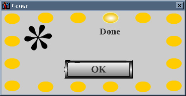



## FlashBox

### Description

This a MsgBox replacement using Flash. While the flash movie is very simple, it does give a good example into using flash with VB. Read the REadme for information before using. The zip contains the dll, dll source, and source for a sample project using the dll. Also included the flash source so you can look at it and change it if you like.
 
### More Info
 

             |
---                |---
**Submitted On**   |2001-01-26 12:06:00
**By**             |[Chris Andersen](https://github.com/Planet-Source-Code/PSCIndex/blob/master/ByAuthor/chris-andersen.md)
**Level**          |Beginner
**User Rating**    |4.0 (28 globes from 7 users)
**Compatibility**  |VB 5\.0, VB 6\.0
**Category**       |[Custom Controls/ Forms/  Menus](https://github.com/Planet-Source-Code/PSCIndex/blob/master/ByCategory/custom-controls-forms-menus__1-4.md)
**World**          |[Visual Basic](https://github.com/Planet-Source-Code/PSCIndex/blob/master/ByWorld/visual-basic.md)
**Archive File**   |[CODE\_UPLOAD141941262001\.zip](https://github.com/Planet-Source-Code/chris-andersen-flashbox__1-14739/archive/master.zip)

